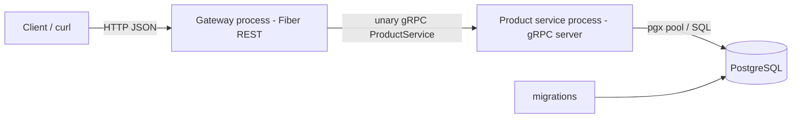
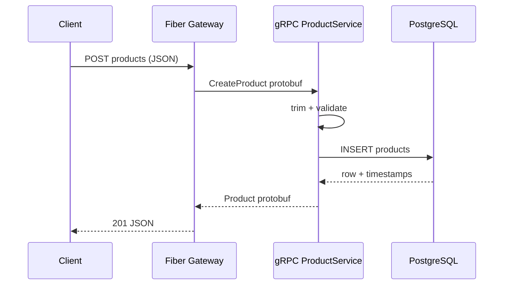
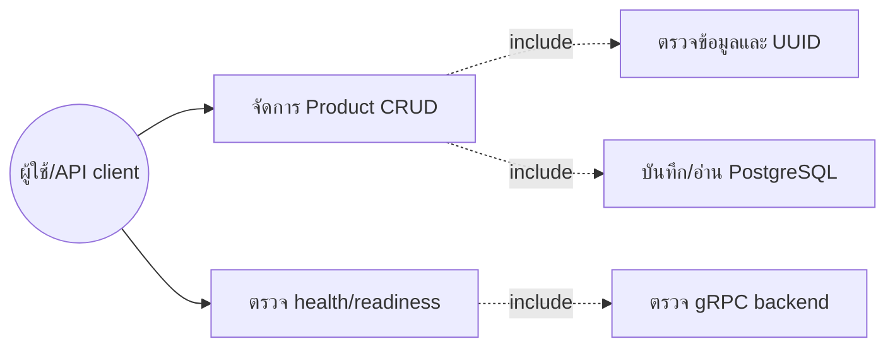

# golang-essential-gRPC — Product CRUD POC

Go + gRPC Product CRUD POC ต่อยอดจากคลิป [มารู้จักกับ gRPC และ Go กัน — mikelopster](https://www.youtube.com/watch?v=YcwvN6utKvk) ด้วย Fiber REST gateway และ PostgreSQL

## Run

```bash
docker compose up --build
```

Gateway: `http://localhost:8080`; gRPC service listens on internal Compose network `product-service:9090`; PostgreSQL: `localhost:5432`. Migrations run on first database initialization.

หาก port ชนกับ service อื่น ให้คัดลอก `.env.example` เป็น `.env` แล้วเปลี่ยน `GATEWAY_PORT` หรือ `POSTGRES_PORT` เช่น `GATEWAY_PORT=18080` โดย URL ที่เรียกต้องใช้ port ใหม่ตามนั้น

## REST API

```bash
curl http://localhost:8080/healthz
curl http://localhost:8080/readyz
curl -X POST http://localhost:8080/api/v1/products -H "Content-Type: application/json" -d '{"name":"Coffee","description":"Arabica","price":12.5,"stock":20}'
curl "http://localhost:8080/api/v1/products?page=1&page_size=20"
curl http://localhost:8080/api/v1/products/<id>
curl -X PUT http://localhost:8080/api/v1/products/<id> -H "Content-Type: application/json" -d '{"name":"Dark Roast","description":"Arabica","price":14,"stock":18}'
curl -i -X DELETE http://localhost:8080/api/v1/products/<id>
```

HTTP mapping: InvalidArgument → 400, NotFound → 404, Unavailable/DeadlineExceeded → 503, other errors → 500. Create returns 201 and delete returns 204.

## Architecture





### Use-case diagram



## คำอธิบายภาษาไทย

โปรเจกต์นี้แบ่งเป็น 2 Go process: gateway รับ REST ด้วย Fiber แล้วเรียก unary gRPC client; product-service รับ RPC, validate ข้อมูล, เรียก repository ที่ใช้ pgx และคืน protobuf กลับไปให้ gateway แปลงเป็น JSON แอปพลิเคชันไม่ใช้ net/http handler โดยตรง

`/healthz` ตรวจ liveness แบบเบา ส่วน `/readyz` เรียก ListProducts ผ่าน gRPC เพื่อยืนยันว่า service และ PostgreSQL พร้อมใช้งานจริง

## Structure

```text
cmd/gateway             Fiber REST gateway
cmd/product-service     gRPC + PostgreSQL process
proto/product.proto     CRUD contract
gen/product             generated protobuf/gRPC code
internal/httpapi        Fiber routes and HTTP mapping
internal/grpcclient     gRPC adapter and timeouts
internal/grpcserver     RPC implementation/status mapping
internal/service        validation/business orchestration
internal/repository     pgx SQL implementation
internal/domain         Product entity/store interface
migrations              PostgreSQL schema
```

## Development

```bash
go mod download
go test ./...
go vet ./...
docker compose config
```

Generated `.pb.go` files are committed. After changing `proto/product.proto`, run `make proto` with protoc and the Go plugins. Unit tests use fake stores for validation and gRPC status mapping; no external DB is required.

ถ้า `protoc` ที่ติดตั้งไม่พบ well-known types (`empty.proto`/`timestamp.proto`) ให้ส่งตำแหน่งโฟลเดอร์ `include` เช่น `make proto PROTOC_INCLUDE=/path/to/protoc/include`

Trade-offs: unary RPC and offset pagination keep the POC teachable; production may need cursor pagination, a versioned migration runner, auth, rate limits and observability.

เอกสารอ้างอิงเพิ่มเติม: [gRPC Go Quick start](https://grpc.io/docs/languages/go/quickstart/) และ [gRPC Go Basics](https://grpc.io/docs/languages/go/basics/)

See [LICENSE](LICENSE) for MIT terms.
