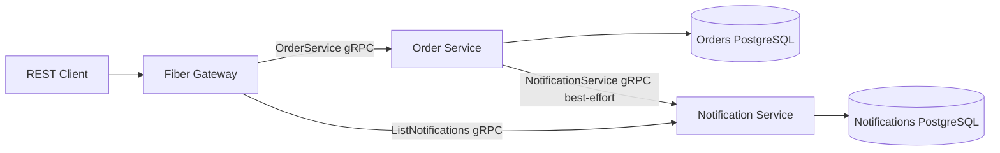
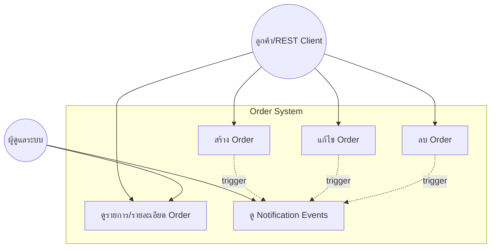
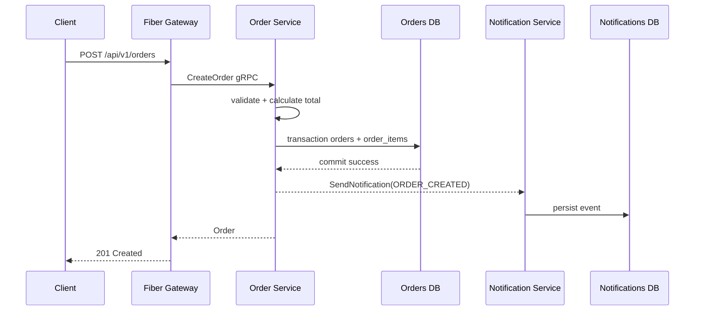

# Go + gRPC Order CRUD POC

POC นี้ต่อยอดจากแนวคิดในคลิป [Go gRPC tutorial](https://www.youtube.com/watch?v=YcwvN6utKvk) โดยแยก gRPC เป็น microservices และใช้ Fiber เป็น REST gateway สำหรับระบบสร้าง/แก้ไข/อ่าน/ลบ Order พร้อมบันทึก notification event ทุก mutation

## ภาพรวมสถาปัตยกรรม



มี 3 process คือ `cmd/gateway`, `cmd/order-service` และ `cmd/notification-service` โดย gateway เป็น process เดียวที่เปิด port ให้ภายนอก ส่วนแต่ละ service เป็นเจ้าของฐานข้อมูลของตนเองและสื่อสารผ่าน protobuf/gRPC เท่านั้น

## Use case



## Flow สร้าง Order



## API

- `POST /api/v1/orders` สร้าง Order; body `customer_name`, `customer_email`, `items[{name,quantity,unit_price}]`, optional `status`
- `GET /api/v1/orders?page=1&page_size=20` list แบบ pagination
- `GET /api/v1/orders/:id` ดูรายละเอียด
- `PUT /api/v1/orders/:id` แก้ไขข้อมูลและรายการสินค้า
- `DELETE /api/v1/orders/:id` ลบ Order
- `GET /api/v1/orders/:id/notifications` ดู event ที่บันทึกโดย Notification Service
- `GET /healthz` และ `GET /readyz` (readiness ตรวจทั้ง gRPC backends)

ตัวอย่าง:

```bash
curl -X POST http://localhost:8080/api/v1/orders -H 'content-type: application/json' -d '{"customer_name":"Alice","customer_email":"alice@example.com","items":[{"name":"Book","quantity":2,"unit_price":125.50}]}'
curl http://localhost:8080/api/v1/orders
curl -X PUT http://localhost:8080/api/v1/orders/<id> -H 'content-type: application/json' -d '{"customer_name":"Alice","customer_email":"alice@example.com","status":"CONFIRMED","items":[{"name":"Book","quantity":1,"unit_price":125.50}]}'
curl http://localhost:8080/api/v1/orders/<id>/notifications
curl -X DELETE http://localhost:8080/api/v1/orders/<id>
```

## Database ownership และ failure semantics

Order Service ใช้ `orders` และ `order_items` ใน `order-db`; Notification Service ใช้ `notifications` ใน `notification-db` โดยมี migration แยกใน `migrations/orders` และ `migrations/notifications` และ volume แยกกัน

Order mutation จะ commit transaction ก่อน แล้วจึงเรียก Notification Service แบบ best-effort หาก notification service ล่ม Order ที่ commit แล้วจะยังสำเร็จและมี log ความล้มเหลว จึงไม่มี rollback หรือ duplicate จากการ retry ใน POC นี้ Production ควรเพิ่ม transactional outbox และ message broker/worker เพื่อ guarantee delivery และ retry อย่างเป็นระบบ (POC นี้ตั้งใจไม่เพิ่ม Kafka, RabbitMQ หรือ outbox)

เพื่อให้ตัวอย่างอ่านง่าย POC ใช้ `double/float64` สำหรับราคาและยอดรวม ส่วนระบบการเงินจริงควรเปลี่ยนเป็นจำนวนเต็มหน่วยย่อย (เช่น satang) หรือ decimal type เพื่อหลีกเลี่ยง floating-point rounding

Gateway map gRPC `InvalidArgument` → HTTP 400, `NotFound` → 404, `Unavailable/DeadlineExceeded` → 503 และ error อื่น → 500

Gateway แปลง protobuf เป็น REST DTO ก่อนตอบกลับ จึงได้ชื่อ field แบบ JSON, status เป็นข้อความ เช่น `PENDING`/`CONFIRMED` และ timestamp เป็น RFC3339 แทนรูปแบบภายในของ protobuf

## Run

```powershell
Copy-Item .env.example .env
docker compose up --build
```

หาก port 8080 ถูกใช้งาน ให้ตั้ง `GATEWAY_PORT` ใน `.env` ได้ ฐานข้อมูลไม่เปิดออกนอก Docker network จากนั้นตรวจ `docker compose config` และทดสอบ `go test ./...`, `go vet ./...`

## โครงสร้าง

`proto/` คือ contract และ generated code อยู่ใน `gen/`; `internal/domain` เป็น model/interface, `internal/service` เป็น validation/total/business logic, `internal/repository` เป็น Order DB transaction, `internal/notification` เป็น Notification DB boundary, `internal/grpcserver` เป็น adapters ของแต่ละ service, `internal/grpcclient` เป็น client adapters และ `internal/httpapi` เป็น Fiber routes
